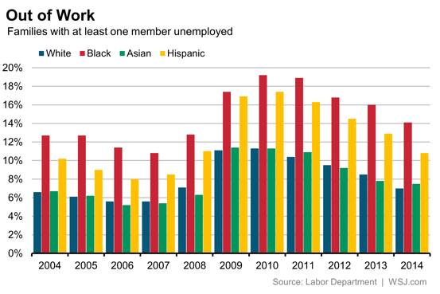

**Eric Diep, CS725 - Homework 8**

# Original Chart
The chart selected for critique and redesign is chart 2 - paired column chart.

The chart is comprised of point marks, and length channel. The vertical spatial position represents the category of ethnicities, and horiztonal spatial position represents the percentage of families where at least one member is unemployed. Color hue is an identity channel used to categorize the ethnicities. In addition, bar chart glpyh is used to be able to present the finding for each year.

The goal of the chart is to present the percentage of families where there is at least one member unemployed for 4 ethnicities over 10 years. This would allow us to compare the change in umemployment rate between ethnicities and within an enthnicity.

# Critique
If I need to compare the change among one ethnicity, this would be challenging because of the distance between bars. For example, if I am trying to compare the percent difference for white families between 2004 and 2014, I would need to memorize the height of the bar. Also, from a quick glance the 2 heights look the same. Also, I find it hard to be able to spot trends and features for each category. I would need to imagine a line connecting the top of each bar to be able to spot trends and features.

Also, I was curious how the chart would look like if converted to grayscale. The image below is the original chart converted to grayscale. As seen, it is hard to tell apart the first two bars in each year. The colormap selected for does not pass the guideline of do it right in black and white.

# Analysis
The provided dataset is a table with the rows being year, and the columns being the ethnicities. The percentage value of families with at least one member unemployed are populated within the table.

# Alternate
Below is an alternate to the original graph. The idiom used is a line chart with point markers. Point marks are used to plot the values, and line marks are used to connect the points to show temporal order. The vertical spatial position represents the year, and the horizontal spatial position represents the percentage value. Originally, the y-axis started at 0, but this left unused space. Thus, I decided to start the y-axis at 4 because the smallest value is 5. I also used the Color Brewer tool to select colors that would stand out if the graph is converted to black-and-white.

I choose to use the line chart with point markers idiom because this allowed for all the graphs to be in one chart. Also, we are able to compare values between and within groups much easier. With the lines connecting the points, we are able to spot trends and features much easier. We are able to pinpoint plateaus, and dramatic increase or decreases in the graphs.  

Below is the first alternate graph converted to black and white. As we see, the colors selected from Color Brewer allowed for each category to stand out even when black-and-white.

Below is a second alternate to the original graph. The idiom used is small multiple line chart. Just like the graph above, the same marks and channels are used. Annotation of the point's value are added, since there is more space in each graph. The difference is each ethnicity has its own graph rather than one chart displaying the 4 ethnicity in one. This allows for comparision within the ethnicity to be simplier. However, this alternate would make comparing among ethnicities a bit harder, but labels are added in hopes of making comparison a bit easier. The graphs are stacked on top of each other to allow for the years to line up. This may allow for comparison among ethnicities to be eaiser.

# Reference
[ColorBrewer 2.0](http://colorbrewer2.org)